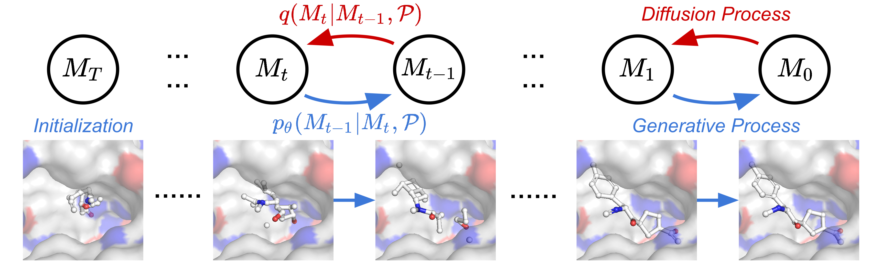

# GraphEncoder

Shape-aware 3D molecular encoders and the diffusion models built on top of them.

The core of the repository is a geometry-aware graph encoder (`cls_graphormer_pearl` by default: a
CLS-token Graphormer with PEARL-style relative-position/shortest-path-distance attention bias, plus
EGNN and plain Graphormer variants). The encoder is used in two ways:

1. **Representation probing** — freeze the encoder, extract embeddings, and train lightweight
   downstream heads (random forest / ridge / kNN) on OGB-style benchmark datasets.
2. **3D diffusion** — the encoder conditions a MolDiff/GeoDiff-style denoiser that generates or
   reconstructs 3D coordinates for molecules and protein pockets.



## Repository layout

| Path | Contents |
| --- | --- |
| `models/` | Encoder variants (`encoder.py`, `uni_transformer*.py`, `egnn.py`), diffusion + transition kernels (`diffusion.py`, `transition.py`), denoisers (`denoiser.py`, `molopt_score_model.py`), property-prediction heads (`models/property_pred/`) |
| `utils/` | Data plumbing, transforms, training loop, covariance-matrix metrics, reconstruction helpers, and geometric/docking quality metrics in `utils/evaluation/` |
| `scripts/` | Entry points: training, layer sweeps, downstream benchmarking, diffusion evaluation, likelihood estimation, data preparation |
| `configs/` | YAML configs: `training.yml` (PCQM4M/ZINC + encoder + model), `train_MolDiff.yml`, `sampling.yml`, `prop/*.yml` (PDBBind property runs), `illegal_smiles.txt` |
| `preprocess/` | Dataset modules (PCQM4M LMDB loader, PDBBind, protein-ligand, PL pair datasets) |
| `notebooks/` | Affinity inference / analysis and result-summary notebooks |
| `examples/` | Example protein–ligand pair (`3ug2`, `1h36`) used by the pocket extraction pipeline |

## Environment

```bash
conda env create -f environment.yaml   # env name: targetdiff (Python 3.8, PyTorch + PyG + RDKit + OGB)
conda activate targetdiff
```

`environment.yaml` is an exact export of the machine the experiments ran on (CUDA 11 builds from the
`pyg`/`pytorch`/`nvidia` channels), so on a different GPU stack it is usually easier to install the
same packages with your own CUDA/cuDNN combination. All scripts assume a CUDA device; `--device`
selects it (`--device cuda:0`).

## Data

- **Small molecules (generation / property):** PCQM4M or ZINC in LMDB form. Build them with
  `scripts/bash_ZINC_preprocess.sh` / `utils/ZINC_preprocess.py`; set the resulting directory in
  `configs/training.yml` → `data.path`. `node_in_dim: 9` / `edge_in_dim: 3` must match the features
  produced by that preprocessing.
- **Protein–ligand:** download CrossDocked2020 and run
  `scripts/data_preparation/{clean_crossdocked,extract_pockets,split_pl_dataset}.py`, then use
  `configs/prop/pdbbind_general_egnn*.yml` for PDBBind property runs.
- **Prepared benchmark datasets** for the downstream probe are the `*.json` / `*.joblib` bundles and
  the shortest-path-distance LMDB cache expected by `scripts/downstream_benchmark_port.py`
  (`--prepared_path`, `--prepared_spd_path`).

## Training

```bash
python scripts/train_diffusion.py \
  --config configs/training.yml \
  --device cuda:0 \
  --exp_name GraphGPS_Encoder \
  --encoder_name cls_graphormer_pearl --encoder_layers 9 \
  --denoiser_name uni_o2_condition --model_layers 5
```

Command-line flags override the corresponding values in the YAML config, so a config file stays
usable as the "default experiment" while sweeps pass their own values. Checkpoints land in
`outputs/checkpoints/training/<date>/` and TensorBoard logs in `--logdir`.

`scripts/train_diffusion2.py` is the variant used while iterating on the fusion scheme;
`scripts/bench_prepared_loader.py` benchmarks the prepared-dataset loader when a data pipeline
change makes the input pipeline the bottleneck.

### Sweeping encoder/denoiser depth

```bash
python scripts/sweep_layers.py --config configs/training.yml --gpus 0,1,2,3 --detach
```

`--detach` keeps the sweep alive after the terminal closes and writes `sweep_daemon.pid` (kill that
PID to stop it); per-run logs go to `--proc_logdir` and the daemon log to `--daemon_log`.
`scripts/bash_sweep_train_diffusion.sh` is the equivalent fixed grid. `--resume` skips combinations
that already produced checkpoints.

## Downstream benchmark (frozen encoder)

```bash
python scripts/downstream_benchmark_port.py \
  --config configs/training.yml \
  --prepared_path /path/to/prepared/ogbg-molsider.json \
  --prepared_spd_path /path/to/prepared_spd_cache \
  --ckpt_date 20260204-181909 --enlayer 9 --delayer 5 \
  --out_dir ./logs_embedding/embedded_cache
```

It loads `best.pt` from the given checkpoint date, embeds the prepared dataset, and reproduces the
protocol of the external molecular-model benchmarking suite (RF / ridge / kNN with `GridSearchCV`),
so encoder variants can be compared on identical folds. `scripts/run_all_downstream_datasets.sh`
loops over every prepared dataset.

## Diffusion sampling and evaluation

```bash
python scripts/evaluate_diffusion.py \
  --ckpt_root outputs/checkpoints/training --ckpt_date 20260302-154952 \
  --encoder_name cls_graphormer_pearl --denoiser_name uni_o2_condition \
  --mode reconstruct --t_recon 50 --n_samples 2 --out_json eval_covmat.json
```

`--mode sample` draws new conformations, `--mode reconstruct` noises a real structure to `--t_recon`
steps and denoises it back. The JSON report contains the atom-type / bond-length / bond-angle
covariance diagnostics; `utils/evaluation/` adds the GeoDiff-style geometry metrics plus SA, QED and
Vina/QVina docking helpers. `scripts/likelihood_est_diffusion.py` computes the bound used for
likelihood estimation, and `scripts/batch_sample_diffusion.sh` runs a batch of sampling jobs.

## Analysis

`notebooks/affinity_inference.ipynb`, `notebooks/analyze_affinity.ipynb` and
`notebooks/summary.ipynb` turn the sweep/benchmark outputs into tables and plots.

## Continuous integration

`.github/workflows/ci.yml` runs on a GPU-free runner and keeps the repository structurally sound:
byte-compiles every Python source (syntax gate), parses all YAML configs and `environment.yaml`,
validates the notebooks as JSON, and fails if runtime artefacts (logs, tfevents, `*.pid`,
`eval_covmat.json`) creep back into version control. Installing PyTorch/PyG/RDKit is deliberately
left out of CI — the training code needs a CUDA machine, so the numerical checks stay local:

```bash
python -m compileall -q models utils scripts preprocess
```

## Artefact policy

`logs_*/`, `outputs/`, `sampling_results/*`, `sweep_daemon.pid`, `sweep_proc_logs/`, TensorBoard
event files and `eval_covmat.json` are experiment outputs and are git-ignored; keep them out of
commits and use your experiment tracker or object storage for history.

## Licence

[MIT](LICENSE) — original work Copyright (c) 2023 Jiaqi Guan, modifications Copyright (c) 2026
Eric-YHS.
